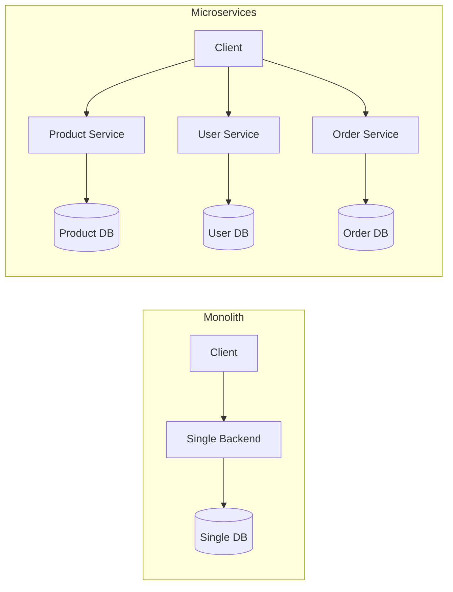
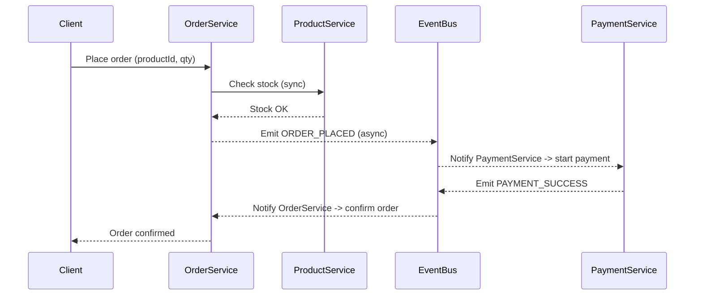

# Microservices Notes (Hinglish) — E-commerce Example 🛒

> **Goal:** Ye file tumhare revision / notes ke liye hai — simple Hinglish mein, diagrams (Mermaid), real e‑commerce example, node.js snippets, aur practical tips. Direct `.md` file save kar lo aur GitHub / Obsidian mein use karo.

---

## 1) Microservices — Seedha Seedha (Layman)
Microservices ka matlab: ek bada software (jaise full e‑commerce site) ko chhote‑chhote **independent services** mein tod do.  
Har service ka apna kaam, apna codebase, aur apna database ho sakta hai. Agar ek service down ho jaye, baki services chalti rehti hain.

**Simple example:**  
- User service — user signup / login  
- Product service — product list, details  
- Cart service — user ke cart ko manage kare  
- Order service — order place kare  
- Payment service — payment handle kare  
- Notification service — emails / SMS bheje

---

## 2) Monolith vs Microservices (Ek hi nazar)
**Monolith:** Sab kuch ek jagah.  
**Microservices:** Har cheez chhoti modules mein.



**Kyun microservices?**  
- Scale karna aasan (sirf heavy service ko scale karo)  
- Alag teams alag services par kaam kar sakti hain  
- Fault isolation — ek service girne par pura system nahi rukta

---

## 3) Communication — Sync aur Async (Bahut important)
- **Synchronous (Sync):** Request → wait for response. (REST / gRPC)  
  Example: Order service -> Product service se "stock check" request bhejta hai aur wait karta hai.
- **Asynchronous (Async / Event Driven):** Event emit karo, koi listener asynchrounously react karega. (Kafka, RabbitMQ, Redis Pub/Sub)

**Sequence diagram (Order place - mix of sync & async):**


---

## 4) E-commerce Example — Detailed Flow (Layman)
1. User selects product on frontend.  
2. Client calls Product Service to fetch details (read).  
3. User clicks *Buy*, frontend calls Order Service with productId & qty.  
4. Order Service calls Product Service (sync) to ensure stock.  
   - Agar stock kam → Order reject.  
   - Agar stock okay → OrderService creates an order in **PENDING** state and emits `ORDER_PLACED` event.  
5. Payment Service listens to `ORDER_PLACED` → starts payment flow (async).  
6. Payment success → emits `PAYMENT_SUCCESS` → OrderService listens and sets order `CONFIRMED` and triggers `DECREMENT_STOCK` event or asks Product Service to decrement stock.  
7. Notification Service listens to `ORDER_CONFIRMED` and sends email/SMS.

**Notes:** Stock decrement can be done sync or async. Async can lead to eventual consistency (thoda delay le sakta hai) — acceptable in many real apps.

---

## 5) Data Ownership & Consistency
- **Rule:** Kisi service ka doosre service ke DB ko directly touch karna mana hai. Hamesha API / events se data lo.
- **Database per service** helps decoupling, par **data duplication** ho sakta hai (copy of product name in order DB for history).
- **Consistency approaches:**  
  - *Strong consistency* (sync calls / distributed transactions — complex)  
  - *Eventual consistency* (events + compensating actions / Saga pattern)

### Saga Pattern (Simple explanation)
Saga = chhote steps jinke success se poora transaction complete hota hai; agar koi step fail ho to previous steps ko undo (compensate) karte hain.

Example: Order -> Payment -> Ship  
- Agar Payment fail, Order ko cancel karo (compensate).

---

## 6) Node.js Example Snippets (Basic, copy-pasteable)

### Product Service (Express)
```javascript
// product-service/index.js
const express = require('express');
const app = express();
app.use(express.json());

const products = [
  { id: 1, name: 'Phone', stock: 10, price: 15000 },
  { id: 2, name: 'Headphone', stock: 5, price: 2000 }
];

app.get('/product/:id', (req, res) => {
  const p = products.find(x => x.id == req.params.id);
  if(!p) return res.status(404).json({ error: 'Not found' });
  res.json(p);
});

app.post('/product/:id/decrement', (req,res) => {
  const p = products.find(x => x.id == req.params.id);
  if(!p) return res.status(404).json({ error: 'Not found' });
  if(p.stock < (req.body.qty || 1)) return res.status(400).json({ error: 'Insufficient stock' });
  p.stock -= (req.body.qty || 1);
  res.json({ ok: true, stock: p.stock });
});

app.listen(3001, () => console.log('Product service on 3001'));
```

### Order Service (Express + axios sync call)
```javascript
// order-service/index.js
const express = require('express');
const axios = require('axios');
const app = express();
app.use(express.json());

let orders = []; // in-memory for demo

app.post('/order', async (req, res) => {
  const { productId, qty } = req.body;
  try {
    // sync check stock
    const p = await axios.get(`http://localhost:3001/product/${productId}`);
    if(p.data.stock < qty) return res.status(400).json({ error: 'Out of stock' });

    const order = { id: Date.now(), productId, qty, status: 'PENDING' };
    orders.push(order);

    // In real app: emit event ORDER_PLACED (to RabbitMQ/Kafka)
    // For demo: return pending order
    res.json(order);
  } catch(err) {
    res.status(500).json({ error: 'Product service error' });
  }
});

app.listen(3002, () => console.log('Order service on 3002'));
```

> **Note:** Sync calls are simple but increase tight coupling and latency. For scale, use events.

---

## 7) Event-driven snippet (pseudo — RabbitMQ style)
```javascript
// producer: emit ORDER_PLACED
channel.publish('exchange', 'order.placed', Buffer.from(JSON.stringify(order)));

// consumer (payment service): listen
channel.consume('orderQueue', (msg) => {
  const order = JSON.parse(msg.content.toString());
  // process payment, then emit PAYMENT_SUCCESS or PAYMENT_FAILED
});
```

---

## 8) Deployment — Local quick setup (docker-compose idea)
```yaml
version: '3'
services:
  product:
    build: ./product-service
    ports: ["3001:3001"]
  order:
    build: ./order-service
    ports: ["3002:3002"]
  rabbitmq:
    image: rabbitmq:3-management
    ports: ["5672:5672","15672:15672"]
```

---

## 9) Observability, Resilience, Security — Quick Tips
- **Logging:** Centralize logs (ELK / Loki).  
- **Metrics:** Prometheus + Grafana.  
- **Tracing:** Jaeger / Zipkin (to follow request across services).  
- **Circuit Breaker:** Stop cascading failures (Hystrix / Opossum for Node).  
- **API Gateway:** Authentication, rate-limiting, routing (Kong, Nginx, or custom).  
- **Security:** Use HTTPS, JWT / OAuth2 for auth, validate all inputs.

---

## 10) Common Pitfalls (Aur unka simple fix)
- Too many tiny services → manageability issue. **Fix:** group related small features.  
- Direct DB access across services → breaks isolation. **Fix:** always use APIs/events.  
- No monitoring → debugging nightmare. **Fix:** add centralized logging/metrics early.

---

## 11) Short Checklist — Jab Project Start Karein
- [ ] Define service boundaries (business capability wise)  
- [ ] Decide events and contracts (what events each service emits/consumes)  
- [ ] Choose sync vs async per flow  
- [ ] Add API gateway & service discovery plan  
- [ ] Setup logging & tracing from day 1  
- [ ] Automate CI/CD & containerize services

---

## 12) Mini Glossary (Easy)
- **Event Bus / Broker:** Middleman for events (RabbitMQ/Kafka)  
- **API Gateway:** Single entry point for clients  
- **Saga:** Pattern to manage distributed transactions  
- **Circuit Breaker:** Prevent repeated failures from a flaky service

---

## 13) Final Notes (Motivational + Practical)
Microservices bahut powerful hain par complexity bhi laate hain. Start simple: agar team chhoti hai to monolith + modular approach pe shuru karo, phir jab zaroorat ho tab split into services. **Learning path:** build small services, add messaging, then add monitoring.

---

## 14) References / Next Steps
- Agar chaho to mai is file ko PDF me convert karke doo, ya har diagram ka PNG bana ke attach kar doon.  
- Chaho to mai same content ka condensed cheat-sheet bhi bana doon.

